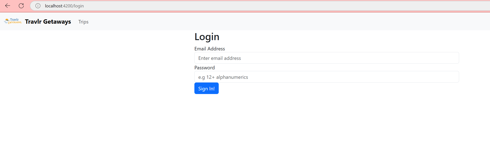
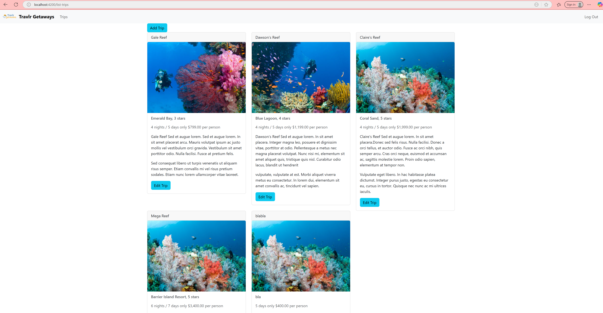
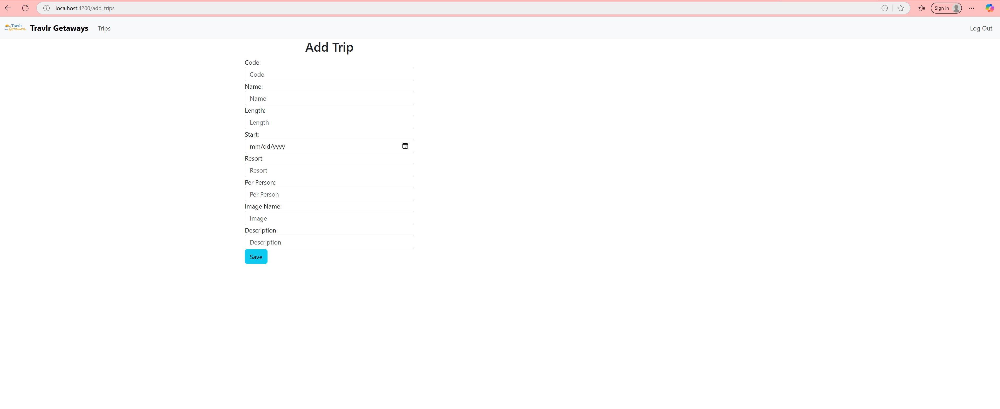
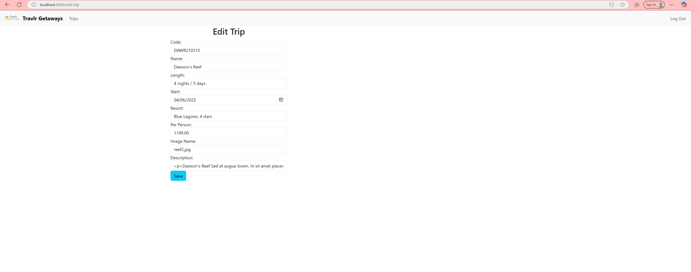
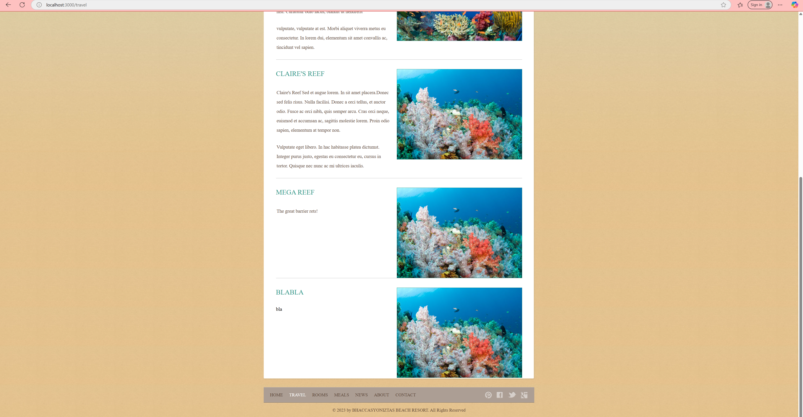

# 🌍 Travlr Getaways - Full Stack Web Application

Welcome to Travlr Getaways! This full stack application allows customers to explore travel packages and gives administrators secure tools to manage trip content. Built with the MEAN stack (MongoDB, Express, Angular, Node.js), the project showcases security, dynamic interfaces, and well-structured backend API design.

---

## 🧱 Architecture

This project highlights two frontend approaches:

- **Express + Handlebars (Server-rendered HTML)**: Used for the public-facing customer side of the website, offering fast load times and SEO advantages.
- **Angular Single-Page Application (SPA)**: Developed for the admin dashboard to provide dynamic interaction without full page reloads. Angular allowed for modular component development and seamless routing within the dashboard.

The backend uses a **MongoDB NoSQL database**. This choice was ideal for its flexibility and its ability to store JSON-like documents. It paired well with JavaScript-based server-side logic, allowing me to move quickly and focus on functionality without strict schema constraints.

---

## ⚙️ Functionality

**JSON vs JavaScript**  
JSON (JavaScript Object Notation) is a lightweight data format used to transmit data between client and server. JavaScript is a programming language. JSON is especially important here as it enables frontend Angular components and backend Express routes to communicate efficiently.

**Refactoring & Reusability**  
Throughout development, I refactored code by:
- Creating Angular services for reusable logic (like authentication).
- Developing modular components like `<app-trip-card>` for cleaner UI updates.
- Structuring Express routes and controllers for separation of concerns.

These changes improved maintainability, enhanced reusability, and made testing easier.

---

## 🧪 Testing & Security

API requests involved various HTTP methods (`GET`, `POST`, `PUT`, `DELETE`) and required authentication for admin routes. Key concepts I applied include:

- **Endpoints**: RESTful routes for trip data (`/api/trips`) and admin login (`/api/login`).
- **Security**: Implemented JWT token-based authentication, password hashing with bcrypt, and route guards in Angular.
- **Testing**: Used Postman to test protected and unprotected endpoints, ensuring proper handling of errors, permissions, and data validation.

---

## 🖼️ Screenshots

### 🔐 Admin Login Page  
Login screen for secure access:  

---

### 🗂️ Admin Dashboard  
Overview of all trips with "Add" and "Edit" options:  

---

### ➕ Add New Trip  
Form for entering a new trip to the database:  

---

### ✏️ Edit Existing Trip  
Admins can modify trip details with this form:  

---

### 🌍 Customer-Facing Updated View  
Newly added or edited trip now appears for all customers:  

---

## 💬 Reflection

This course helped me gain confidence as a full stack developer. I learned to:
- Develop secure, scalable web applications
- Work with MongoDB and build REST APIs
- Build dynamic SPAs using Angular
- Understand the full cycle of development—from frontend logic to database modeling

These skills have made me a more competitive and versatile candidate in the tech industry. I now feel equipped to contribute meaningfully in web development teams and freelance roles alike.

---

## 📎 GitHub Repository

👉 [GitHub Repository](https://github.com/gdelsolra/cs465-fullstack)
